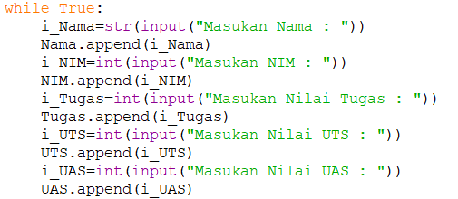

# list_python
Pada pemrograman Python, List dibuat dengan menempatkan semua item (elemen) di dalam kurung siku 
dipisahkan dengan tanda koma .
# Latihan 1
Buat sebuah list sebanyak 5 elemen dengan nilai bebas

Berikut tampilan program sebelum dijalankan

### Akses list
kode :
>>NamaBuah = ["Mangga","Apel","Jeruk","Anggur","Melon"]
* kemudian untuk menampilkan elemen ke 3 dalam list gunakan kode berikut :
>>print("Tampilkan Buah ke-3 :", NamaBuah[2])
* untuk perintah mengambil elemen ke 2 sampai ke elemen ke 4 gunakan kode berikut :
>>print("Ambil Nama Buah ke 2 sampai 4 :", NamaBuah[1:4])
* lalu untuk perintah mengambil elemen terakhir bisa menggunakan kode berikut :
>>print("Ambil Nama buah Terakhir :", NamaBuah[5-1])

### mengubah elemen list
* untuk merubah elemen ke empat dengan nilai lain gunakan kode berikut :
>>NamaBuah[3] = "Durian"
* untuk merubah elemen ke 4 sampai terakhir gunakan kode berikut :
>>NamaBuah[3:] = "Mangga","Nanas"

### menambahkan elemen
buat 2 list
misal :
>>A = [1,2,3,4,5]
B = [6,7,8,9,10]
* menambahkan list A ke list B gunakan perintah sebagai berikut:
>>B.append(A[1:3])
print("2 Bagian dari list A dijadikan list B:",B)
* menambahkan list B dengan string, gunakan perintah sebagai berikut:
>>B.append("Bilangan Positif")
print ("Menambahkan list B dengan string:" , B)
* menambahkan list B dengan 3 nilai, gunakan perintah sebagai berikut :
>>print("menambahkan list B dengan 3 nilai:", B+[11,12,13])
* menggabungkan list A dan list B, gunakan perintah berikut :
>>Bilangan=A+B
print("Gabungan dari list A dan list B :", Bilangan)

### berikut tampilan program setelah di jalankan

# Tugas Praktikum
* Berikut flowchart program daftar nilai siswa :

* Berikut Tampilan program daftar nilai siswa :

* untuk mendefinisikan index gunakan perintah berikut :
>>i=0
* untuk membuat list Nama, NIM, Nilai tugas, UTS, UAS, dan nilai akhir gunakan perintah berikut :

* menginput nilai ke dalam list yang telah dibuat, gunakan append dan perulangan berupa while :

* mengitung nilai akhir atau rata-rata :

* untuk menampilkan pertanyaan menambah data atau tidak gunakan kode berikut :

### Berikut Tampilan Program setelah dijalankan

